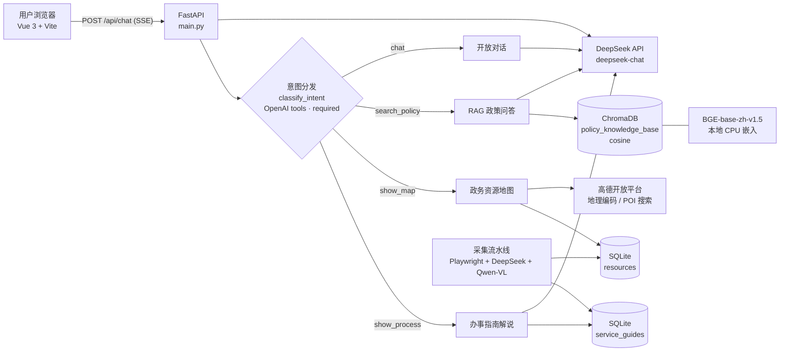

# NewCitizen · 市民服务平台大模型应用

> 面向政务办事场景的大模型应用：Function Calling 意图分发 + RAG 政策问答 + 政务资源地图 + 办事指南解说。
> An LLM-powered citizen-service assistant: function-calling intent routing over RAG, map and guided-process modules.


---

## 项目简介

市民办事时要在不同入口之间来回找：办事指南在政务服务网、办事地点在地图 App、政策原文在文件库里。本项目把这些需求收敛到**一个对话入口**，用一个助手同时承担四类政务咨询：

| 用户想做什么 | 助手的处理链路 |
| --- | --- |
| 问「办这个事项要什么材料、走哪些步骤」 | 精确匹配 `service_guides` 表 → 拼装结构化解说 → 流式播报 |
| 问「离我最近的办事大厅在哪」 | 多维模糊匹配 `resources` 表 → Haversine 算距离排序 → 地图打点 |
| 问「某政策文件怎么规定的」 | ChromaDB 向量检索 Top-5 → 拼接上下文 → 约束式生成 + 出处回显 |
| 闲聊或兜底 | 直接交由大模型回答 |

**核心设计**：意图分发不是关键词规则，而是用 **OpenAI tools 协议**把四类能力声明为 4 个工具，让模型自己选工具并抽参数（`tool_choice="required"`），后端按工具名路由到对应 Handler，再通过 SSE 把文本与结构化指令（`meta`）一起流式推给前端。

> 本项目为大连工业大学计算机科学与技术专业本科毕业设计，独立完成；代码可运行、可演示，数据取自公开的政务网站。

## 界面截图

> 截图位于 `docs/screenshots/`，命名规范见本节末尾。

| 对话与意图分发 | 政务资源地图 |
| --- | --- |
|  |  |

| 信息溯源（知识库引用） | 管理后台 |
| --- | --- |
|  |  |

截图命名规范：放在 `docs/screenshots/`，PNG，宽度 1600px 左右（Retina 截图可先缩放到 1600 宽），文件名固定为 `01-chat.png`、`02-map.png`、`03-trace.png`、`04-admin.png`。

## 功能特性

**对话侧**

- 四种对话模式（`auto` / `policy` / `map` / `service`），可手动锁定链路，也可交由模型自动分发
- 意图分发：4 个工具 `show_process` / `show_map` / `search_policy` / `chat`，由 `deepseek-chat` 判定并抽取参数
- SSE 流式输出：`token`（增量文本）、`meta`（结构化指令，驱动右侧地图 / 流程面板 / 引用面板）、`done`
- 会话管理：新建（LLM 自动起标题）、重命名、删除、历史消息回读；每次请求带最近 6 条上下文
- 信息溯源：RAG 命中的片段、来源文件与页码随回答一起返回并在前端展示
- 提示注入防护：每条 system 消息统一追加 `INJECTION_GUARD`

**管理侧**

- 知识库管理：上传 PDF / Word / TXT / Markdown → 自动切分、向量化、入库；支持分片预览、删除（连带清理向量）
- 资源管理：资源点增删改查、分页检索、高德 POI 搜索一键导入、审核状态流转
- 用户管理：用户列表、删除、重置密码；后台路由带 JWT + `role == admin` 双重校验

**数据侧**

- 政务数据采集流水线：Playwright 抓页面 → DeepSeek 抽取正文为 JSON → Qwen-VL 解析办事流程图截图 → 高德地理编码补经纬度 → 入库

## 系统架构



**一次请求的完整链路**

1. 前端 `sendToAIStream()` 取浏览器定位，`fetch` 后端 `/api/chat` 并逐块读取响应体
2. 后端落库用户消息 → 取出最近 6 条历史 → `llm.classify_intent()` 让模型选工具
3. 按工具名分发：`handle_process_stream` / `handle_map_stream` / `handle_rag_stream` / `handle_chat_stream`
4. 各 Handler 先 yield 一条 `meta`（结构化数据），再流式 yield `token`
5. `_sse_wrapper()` 转成 `data: {...}\n\n`，结束后把 AI 消息（含 `sources`）落库
6. 前端依据 `meta.ui_command`（`SHOW_PROCESS` / `SHOW_MAP` / `SHOW_TRACE` / `DEFAULT`）驱动右侧面板

### 目录结构

```
NewCitizen-Platform/
├── backend/                      # FastAPI 服务
│   ├── main.py                   # 应用入口、路由、SSE 包装
│   ├── database.py               # SQLAlchemy 引擎与会话
│   ├── models.py                 # User / Document / Conversation / Message / Resource / ServiceGuide
│   ├── init_db.py                # 建表 + 初始化管理员
│   ├── utils/auth.py             # JWT 签发与校验
│   ├── routers/admin/            # 后台接口：文档 / 资源 / 用户
│   ├── tools/
│   │   ├── service_importer.py   # 政务数据采集流水线（Playwright + 双模型抽取）
│   │   └── amap_seeder.py        # 高德 POI 批量导入
│   └── app/
│       ├── core/
│       │   ├── llm_client.py     # DeepSeek 客户端、意图分发、提示注入护栏
│       │   ├── vector_engine.py  # ChromaDB + BGE 嵌入、切分策略、增删查
│       │   └── prompts/          # intent / generation / extraction / utility 提示词
│       └── services/stream_builder.py   # 四条业务链路的流式实现
├── frontend/                     # Vue 3 + Vite 单页应用
│   └── src/
│       ├── api/                  # request / chat / admin / login
│       ├── modules/              # ChatArea / LeftSidebar / RightSidebar
│       ├── store/                # 会话、RAG 状态、右侧面板、UI 状态
│       └── views/                # HomeView / LoginView / admin/{Dashboard,KnowledgeBase,ResourceManage,UserManage}
├── docs/screenshots/             # README 截图
├── dev.bat                       # Windows 一键起前后端
└── PROJECT_STRUCTURE.md          # 更细的模块拆分与设计说明
```

## 技术栈

| 层 | 选型 |
| --- | --- |
| 前端 | Vue 3（Composition API）、Vite 7、vue-router、Axios、Element Plus、markdown-it + DOMPurify、高德 JS API |
| 后端 | Python、FastAPI（异步）、SQLAlchemy、SQLite、JWT（python-jose）、passlib、SSE |
| 大模型 | DeepSeek `deepseek-chat`（对话 / 意图分发 / 结构化抽取）、阿里云百炼 `qwen3-vl-flash`（流程图截图理解） |
| 检索 | ChromaDB（cosine）、`bge-base-zh-v1.5` 本地 CPU 嵌入、LangChain 文本切分与文档加载 |
| 采集 | Playwright（无头 Chromium）、Requests、高德 Web 服务 API |
| 工程 | Git、Docker 化部署待补、Windows 开发脚本 |

## 快速开始

### 环境要求

- Python 3.10+（开发环境为 3.11）
- Node.js `^20.19.0 || >=22.12.0`
- 可访问 DeepSeek API；如需验证地图功能，需要高德开放平台 Key

### 1. 后端

```bash
cd backend
python -m venv .venv
# Windows: .\.venv\Scripts\Activate.ps1
# Linux/macOS: source .venv/bin/activate
pip install -r requirements.txt
playwright install chromium          # 仅数据采集脚本需要

cp .env.example .env                 # Windows: copy .env.example .env
# 编辑 .env，至少填 DeepSeek_API_Key

python init_db.py                    # 建表 + 创建管理员账号
uvicorn main:app --reload --host 0.0.0.0 --port 8000
```

启动后可访问 API 文档：<http://127.0.0.1:8000/docs>

### 2. 嵌入模型（向量检索必需）

`vector_engine.py` 从**本地目录**加载嵌入模型，且在进程启动时强制离线（`TRANSFORMERS_OFFLINE=1`、`HF_HUB_OFFLINE=1`），所以模型必须提前下载到：

```
backend/data/models/bge-base-zh-v1.5/
```

方式一（HuggingFace）：

```bash
pip install -U huggingface_hub
huggingface-cli download BAAI/bge-base-zh-v1.5 --local-dir backend/data/models/bge-base-zh-v1.5
```

方式二（国内网络走 ModelScope）：

```bash
pip install modelscope
python -c "from modelscope import snapshot_download; snapshot_download('BAAI/bge-base-zh-v1.5', local_dir='backend/data/models/bge-base-zh-v1.5')"
```

需要改路径时，只改 `backend/app/core/vector_engine.py` 里的 `model_name` 一处。

### 3. 前端

```bash
cd frontend
npm install
cp .env.example .env                 # Windows: copy .env.example .env
# 填 VITE_AMAP_KEY；后端不在本机 8000 端口时改 VITE_API_BASE_URL
npm run dev                          # 默认 http://localhost:5173
```

### 4. 一键启动（Windows）

根目录 `dev.bat`：用 Windows Terminal 分屏同时启动后端（`.newcitenv` 虚拟环境 + uvicorn）与前端（`npm run dev`）。

### 5. 默认账号

`python init_db.py` 会创建管理员 `admin`，初始密码写在 `init_db.py` 中（`hanadmin`）。**首次登录后请立即修改**，正式部署前建议改成从环境变量读取。

## 配置项

后端 `backend/.env`：

| 变量 | 说明 |
| --- | --- |
| `DeepSeek_API_Key` | DeepSeek API Key（对话、意图分发、结构化抽取） |
| `DeepSeek_Base_URL` | DeepSeek 兼容地址，默认 `https://api.deepseek.com` |
| `DASHSCOPE_API_Key` | 阿里云百炼（DashScope）API Key，仅采集流水线用 Qwen-VL 解析流程图 |
| `DASHSCOPE_Base_URL` | 百炼兼容模式地址，默认 `https://dashscope.aliyuncs.com/compatible-mode/v1` |
| `AMAP_WEB_KEY` | 高德 **Web 服务** Key，用于地理编码与 POI 搜索 |
| `JWT_SECRET_KEY` | 登录令牌签名密钥，请自行生成随机串 |

前端 `frontend/.env`：

| 变量 | 说明 |
| --- | --- |
| `VITE_API_BASE_URL` | 后端地址，默认 `http://127.0.0.1:8000`；部署时改成实际域名 |
| `VITE_AMAP_KEY` | 高德 **JS API** Key（浏览器端地图） |
| `VITE_AMAP_SECURITY_KEY` | 高德 JS API 安全密钥，`MapContainer.vue` 使用 |
| `VITE_AMAP_SECURITY_CODE` | 同上，`ResourceMapPreview.vue` 使用（两个组件变量名尚未统一，两个都填最省事） |

> 高德需要两个 Key：浏览器端地图用 **JS API Key**（配安全密钥），服务端地理编码 / POI 用 **Web 服务 Key**。

## 主要接口

| 方法 | 路径 | 说明 |
| --- | --- | --- |
| POST | `/api/chat` | 核心对话入口，SSE 流式返回 |
| POST | `/login` | 登录，返回 JWT |
| POST | `/api/register` | 注册普通用户 |
| GET / POST | `/api/conversations?user_id=` | 会话列表 / 新建会话 |
| PATCH / DELETE | `/api/conversations/{id}` | 重命名 / 删除会话 |
| GET | `/api/conversations/{id}/messages` | 历史消息 |
| GET / POST / PATCH / DELETE | `/api/admin/docs*` | 知识库文档：列表、上传（自动向量化）、分片预览、删除 |
| GET / POST / PATCH / DELETE | `/api/admin/resources*` | 资源点：分页检索、增删改、高德 POI 搜索导入 |
| GET / DELETE | `/api/admin/users*` | 用户列表、删除、重置密码 |

## 数据模型

| 表 | 关键字段 | 用途 |
| --- | --- | --- |
| `users` | `username`、`password`(PBKDF2)、`role`(admin/user) | 账号与权限 |
| `conversations` | `title`、`user_id`、`updated_at` | 会话 |
| `messages` | `convo_id`、`role`、`content`、`sources` | 消息与引用出处 |
| `documents` | `filename`、`status`、`chunk_count`、`uploader_id` | 知识库文档台账 |
| `resources` | `name`、`category`、`address`、`latlng`、`tags`、`status` | 政务资源点 |
| `service_guides` | `title`、`dept_name`、`conditions`、`materials`、`flow_steps`、`address`、`latlng`、`source_url` | 办事指南（JSON 字段以文本存储） |

## 检索与生成策略

- **切分**：两种策略可选。固定切片用 `CharacterTextSplitter`；语义切片用 `RecursiveCharacterTextSplitter`（分隔符优先级 `\n\n` → `\n` → `，` `。` `！` `？` ` `），后台可选 `chunk_size` 与 `chunk_overlap`
- **嵌入**：`bge-base-zh-v1.5`，本地 CPU 推理，向量归一化；Chroma 集合 `policy_knowledge_base` 使用 cosine 距离
- **检索**：`search_knowledge(query, top_k=5)`，返回内容 + 来源文件 + 页码
- **生成**：命中片段拼进 `RAG_PROMPT`，要求模型只依据给定材料作答、材料不足时明确说明，并把来源数组随 `meta` 一起下发前端做溯源展示
- **意图分发**：`INTENT_TOOL_DEFINITIONS` 声明 4 个工具（含参数 schema），`tool_choice="required"` 强制模型给出工具调用；`active_mode` 非 auto 时由前端锁定链路

## 数据采集流水线

`backend/tools/service_importer.py` 是一个可独立运行的数据管道：

1. `collect_urls_from_filter()` 复用政务服务网站自身的列表接口翻页（`pageSize=5` + 1 秒礼貌延迟），按 `ITEM_ID` 去重，拼出详情页 URL
2. `_get_page_content()` 用 Playwright 无头 Chromium 打开详情页，取正文容器文本，并对流程图 `` 截图转 base64
3. `_ai_parse_text()` 用 DeepSeek 把正文抽成结构化 JSON（申请条件、材料清单、办理地址、电话……）
4. `_ai_parse_vision()` 用阿里云百炼 Qwen-VL 读流程图截图，输出带序号与说明的办理步骤
5. `_get_latlng()` 调高德地理编码把地址换成经纬度
6. `process_single_url()` 汇总写入 `service_guides`

> 采集脚本面向公开政务页面，请遵守目标站点的 robots 与使用条款，仅用于学习研究。

## 已知限制与后续计划

**限制（如实列出）**

- 检索是**纯向量 Top-k**，尚未实现混合检索、Rerank 与查询重写；文档量增大后召回质量会下降
- 嵌入在 CPU 上跑，批量入库较慢；未做向量库的增量索引优化
- 单机 SQLite + 本地 ChromaDB，未做并发压测、限流与容器化部署
- CORS 允许所有来源（`allow_origins=["*"]`），管理员初始密码硬编码在 `init_db.py`，**正式部署前必须收紧**
- 尚无单元测试与 CI；采集脚本依赖政务网站页面结构，站点改版会失效

**计划**

- [ ] 混合检索（向量 + BM25）与 Rerank，配套一个小规模评测集做效果对比
- [ ] Docker Compose 一键部署（后端 + 前端 + 向量库持久化）
- [ ] 流式响应的中断与重试、长会话的记忆压缩
- [ ] 前端高德安全密钥变量名统一，密钥校验提示
- [ ] 补关键链路的单元测试与 GitHub Actions

## 开发说明

- 后端所有提示词集中在 `backend/app/core/prompts/`，改行为先改提示词，再考虑改代码
- 新增一类意图的步骤：① 在 `prompts/intent.py` 加工具定义 → ② 在 `services/stream_builder.py` 实现 `handle_xxx_stream` → ③ 在 `main.py` 的工具名路由表加映射 → ④ 前端在 `RightSidebar` 处理新的 `ui_command`
- 前端接口调用统一走 `src/api/request.js` 的两个 axios 实例（带 token 的 `service` / 不带 token 的 `request`），后端地址由 `VITE_API_BASE_URL` 注入

## 致谢

- 数据来源：大连政务服务网（公开页面）、高德开放平台
- 模型能力：DeepSeek API、阿里云百炼 Qwen-VL
- 检索栈：LangChain、ChromaDB、BGE

## License

[MIT](LICENSE) © 2026 Han Jun
